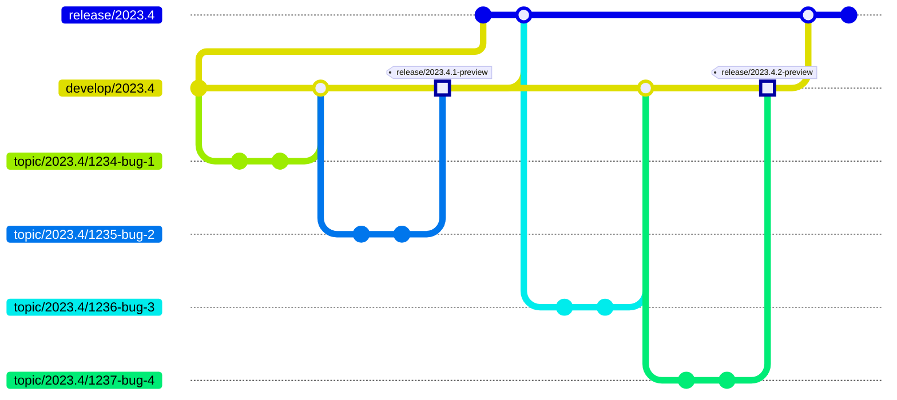

## Our Git flow

* We don't use the `master` or `main` branches.
* We generally work on three versions concurrently, numbered `YYYY.N`. Typically, one is stable and maintained, another is `rc`, and the third is `preview`.
* You should typically check out the `release/YYYY.N` branch.
* Our continuous integration branches are `develop/YYYY.N`. These often depend on unpublished build artifacts of dependencies, so they _cannot_ be easily built by the public unless the dependencies are built locally. Occasionally, our `develop/YYYY.N` builds may be broken.
* When we publish artifacts (for instance, to `nuget.org`):
  - We update the version of package references to those just uploaded to `nuget.org`.
  - We mark the released commit with the precise package version, e.g., `/release/2023.4.1-preview`.
  - We merge the `develop/YYYY.N` branch into `release/YYYY.N`.
* We work on branches named `topic/YYYY.N/whatever` and generally do PRs to `develop/YYYY.N`.
* After any merge to an "old" `develop/YYYY.N`, the "old" `develop/YYYY.N` is automatically merged into the newer `develop/YYYY.N+1`. A merge commit named `merge/YYYY.N+1/commit-123456` is automatically created, tested, merged if possible, and then deleted.
* We use a private TeamCity service for our continuous integration.

### Illustration

The following diagram illustrates our workflow. It shows two public builds, `2023.4.1-preview` and `2023.4.2-preview`, each including two bug fixes.


The "commit" before the first "merge develop/2023.4" is a workaround for https://github.com/mermaid-js/mermaid/issues/5898 and should be removed when fixed.


